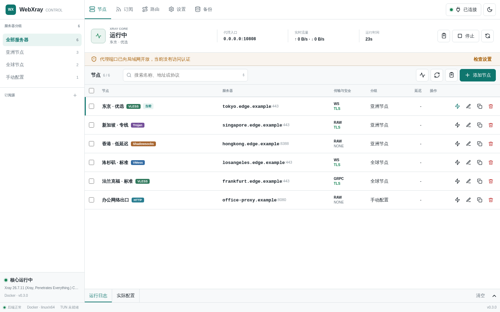

# WebXray

WebXray 是一个在浏览器中管理 Xray 的本地控制台。它负责节点与订阅、Xray 核心启停、
Mixed 代理、路由、Linux TUN、运行日志和数据备份。



打开页面就是主控制台。右上角显示 Web 后端连接状态，首页运行区显示 Xray 核心状态、
当前节点、代理入口和实时流量。这两个状态彼此独立，后端已连接不代表 Xray 已启动。

## 选择版本

| 版本 | 适合谁 | 运行方式 | TUN | 数据目录 |
| --- | --- | --- | --- | --- |
| Docker | Linux 服务器、NAS、容器用户 | 容器自动运行 | Linux 宿主支持 | 挂载到 `/data` |
| Deb | Debian、Ubuntu 实机或虚拟机 | systemd 服务 | Linux 支持 | `/var/lib/webxray` |
| Windows 免安装版 | Windows 桌面 | 前台直接运行 | 不支持 | 解压目录的 `data` |
| Windows 服务版 | Windows 桌面和服务器 | Windows 系统服务 | 不支持 | `C:\ProgramData\WebXray` |

只想先体验：Windows 使用 `WebXray-Run.cmd`，Linux 服务器优先使用 Docker 普通代理模式。
需要开机自启：Windows 注册服务，Deb 安装后自动启用 systemd。需要透明代理：使用 Linux
Deb，或使用 Docker TUN 模式。

完整能力边界见 [平台支持矩阵](docs/PLATFORMS.md)。

## 快速开始

### Docker 普通代理

```bash
mkdir webxray && cd webxray
curl -O https://raw.githubusercontent.com/coalca/webxray/main/deploy/docker/compose.yaml
docker compose up -d
docker compose exec webxray node server/launcher.mjs --print-token
```

浏览器打开 `http://服务器地址:3000`，点击右上角“未连接”，输入上一步显示的令牌。默认
Compose 允许局域网访问 Web 页面，但 Mixed 代理端口只绑定宿主机本地地址。

需要 Linux TUN 时使用 [Docker 安装说明](docs/install/docker.md) 中的专用配置。

### Debian / Ubuntu

从 [GitHub Releases](https://github.com/coalca/webxray/releases) 下载对应架构的 Deb：

```bash
sudo apt install ./webxray_0.3.1_amd64.deb
sudo webxray token
sudo webxray -s status
```

Deb 已内置所需 Node.js 运行时，不依赖系统中的 Node 版本。详细命令和 TUN 条件见
[Linux 安装说明](docs/install/linux.md)。

### Windows

下载 `webxray_0.3.1_windows_x64.zip` 并解压到固定目录：

- 双击 `WebXray-Run.cmd`：前台直接运行，关闭窗口即停止，不需要管理员权限。
- 管理员运行 `WebXray-Install-Service.cmd`：安装为自动启动的 Windows 服务。
- 管理员运行 `WebXray-Uninstall-Service.cmd`：移除服务，保留 `C:\ProgramData\WebXray`。

Windows 版不会修改系统代理，也不提供 Linux TUN。详细说明见
[Windows 安装说明](docs/install/windows.md)。

## 数据目录

各发行版本使用相同的数据结构。Windows 免安装版保存在解压目录，服务版保存在
`C:\ProgramData\WebXray`：

```text
data/
├── config.json                 Web 端口、访问令牌、CORS、时区
├── state.json                  节点、订阅、路由和运行设置
├── logs/                       Windows 服务日志
└── xray/
    ├── xray 或 xray.exe        可替换的 Xray 核心
    ├── geoip.dat               可替换的 GeoIP 数据
    ├── geosite.dat             可替换的 GeoSite 数据
    ├── config.json             最近一次已验证的运行配置
    └── config.candidate.json   配置校验候选文件
```

首次启动只补齐缺少的 Xray 和 Geo 文件，不覆盖用户替换的文件。升级前备份整个数据目录。

## 文档

- [文档索引](docs/README.md)
- [平台支持矩阵](docs/PLATFORMS.md)
- [Docker 安装](docs/install/docker.md)
- [Deb / Linux 安装](docs/install/linux.md)
- [Windows 安装](docs/install/windows.md)
- [安全边界](docs/SECURITY.md)
- [升级与回滚](docs/UPGRADING.md)
- [仓库结构](docs/ARCHITECTURE.md)
- [v0.3.0 开发与验收计划](docs/DEVELOPMENT_PLAN.md)
- [版本记录](CHANGELOG.md)

WebXray 使用 MIT License。发行包内的 Xray-core、Node.js、WinSW 和 Geo 数据许可见
[THIRD_PARTY_NOTICES.md](THIRD_PARTY_NOTICES.md)。
